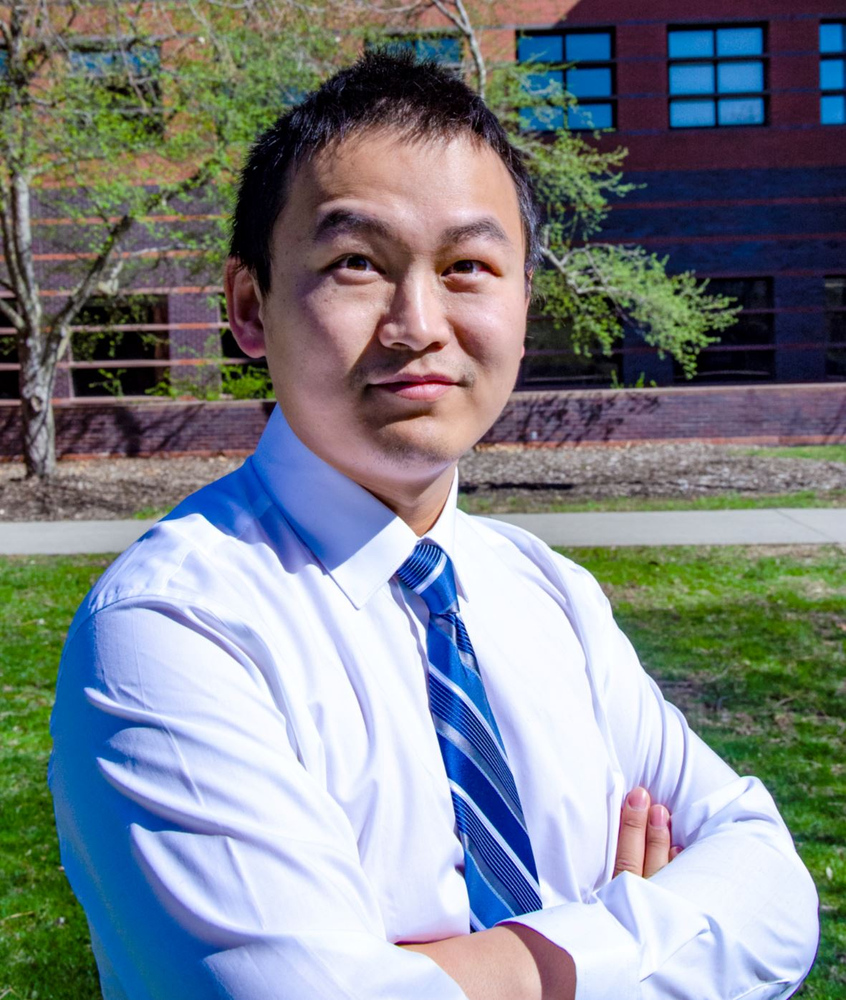

## About Me

I am a Ph.D. student of [Department of Industrial and Manufacturing Systems Engineering](https://www.imse.iastate.edu/) at [Iowa State University](https://www.iastate.edu/).

Currently, I am working for the [Flexible Electronics and Additive Printing (FEAP) Laboratory](https://www.imse.iastate.edu/feap/) & [In-situ Characterization for Additive Printing (iCAP) Laboratory](https://www.imse.iastate.edu/feap/).

Black 1117/1119, Iowa State University, Ames, Iowa, 50011          Email:xiao1@iastate.edu                   Phone:(919)-758-3668
- - -

## Research Interest
Electrohydrodynamic Ink-Jet Printing of micro/nano flexible electronics; In-situ Image processing and close-loop control; Laser diffraction technique; Laser ablation technique; Bio-printing and Food printing 
; Large scale integrated circuit fabrication

- - -
## Education
Ph.D. in [Department of Industrial and Manufacturing Systems](https://www.imse.iastate.edu/), Expected graduation time 2021  
[Iowa State University](https://www.iastate.edu/); Ames, Iowa 

Ph.D. in [Mechanical and Aerospace Engineering](https://www.mae.ncsu.edu/), December 2017  
[North Carolina State University](https://www.ncsu.edu/); Raleigh, North Carolina 

M.S. in [Department of Material Science and Engineering](http://smse.whut.edu.cn/bkspy/zysz/index_1.htm), June   2015  
[Wuhan University of Technology](http://english.whut.edu.cn/); Wuhan, China   

B.A. in [Department of Material Science and Engineering](http://smse.whut.edu.cn/bkspy/zysz/index_1.htm), June   2012  
[Wuhan University of Technology](http://english.whut.edu.cn/); Wuhan, China  

B.A. in [Business Administration](https://www.china-admissions.com/wuhan-university/programs/bachelors/bachelors-business-administration-wuhan-university/), June   2012  
[Wuhan University](http://en.whu.edu.cn/); Wuhan, China 

- - -
## RESEARCH EXPERIENCE
**Graduate Research Assistant**, December   2017 - present  
[Department of Industrial and Manufacturing Systems](https://www.imse.iastate.edu/); [Iowa State University](https://www.iastate.edu/)  
Fabricate flexible electronics by electrohydrodynamic ink-jet printing technique combined with laser ablation  

**Graduate Research Assistant**, October   2016 – March 2017 
[Department of Biological and Agricultural Engineering](https://www.bae.ncsu.edu/); [North Carolina State University](https://www.ncsu.edu/)   
Process data for air quality evaluation using excel

**Graduate Research Assistant**, September   2013 – June 2015 
[Department of Material Science and Engineering](http://smse.whut.edu.cn/bkspy/zysz/index_1.htm); [Wuhan University of Technology](http://english.whut.edu.cn/)   
Manufacture helical gear and optimize the mold with finite element simulation technique

**Graduate Research Assistant**, September   2013 – June 2015 
[Department of Automotive Engineering](http://english.whut.edu.cn/scientficr/RFD/201001/t20100118_2667.htm); [Wuhan University of Technology](http://english.whut.edu.cn/)   
Apply fine blanking technique to do simulation, manufacturing, machine development and material testing 

**Graduate Research Assistant**, September   2013 – June 2015 
[Department of Material Science and Engineering](http://smse.whut.edu.cn/bkspy/zysz/index_1.htm); [Wuhan University of Technology](http://english.whut.edu.cn/)  
**National Natural Science Foundation** of China project “Helical cylindrical gear precision forming mechanism and technology research”(project number: Project Number: 51375356). 

- - -
## TEACHING EXPERIENCE
**Teaching Assistant**, January   2018 –  May 2018
Engineering Fundamentals & Problem Solving; Iowa State University 

- - -
## WORK & PROJECT EXPERIENCE 
**Equipment Engineer**, March   2013 – September 2013 
[Semiconductor Manufacturing Incorporation (SMIC)](http://www.smics.com/eng/index.php); Shanghai   
Packing and testing wafer, maintain PVD, CVD, photoresist coater/decoater machine, develop recipe

- - -
## HONORS & AWARDS 
* NSF Award Winner of the 47th North American Manufacturing Research Conference, 2019
* NSF Award Winner of 2018 Annual International Solid Freeform Fabrication Symposium, August 2018
* National Scholarship, Wuhan University of Technology, 2013 – 2015 
* University Scholarship, Wuhan University of Technology, 2009 – 2011 

- - -
## PUBLICATIONS
**5.** "Correlation Approach for 3D Surface Measurement Data of Additive Manufacturing Parts Based On Optical Metrology", Submitted, Journal of Manufacturing Sciencena and Engineering, April 2019

**4.** "In-situ monitoring of electrohydrodynamic inkjet printing via scalar diffraction for printed droplets", Submitted,Journal of Manufacturing Systems, April 2019

**3.** “Laser Ablation of Polymers: A Review",published,Polymer International, May 2019

**2.** “3D printing and characterization of hydroxypropyl methylcellulose and methylcellulose for biodegradable support structures", published,Polymer, April 2019

**1.** “Machine vision assisted micro-filament detection for real-time monitoring of electrodydrodynamic inkjet printing”, published, Procedia Manufacturing Journal & International Conference in Flexible in Flexible Automation and Intelligent Manufacturing Conference 2018, Ohio State University; June 2018

- - -
## PRESENTATIONS 
**11.** "A Low-cost On-board Sensing Device for Road Surface Condition Assessment", IISE 2019 conference. Orlando, May 2019.

**10.** "3D Printing and Characterization of Cellulose Derivatives for Biodegradable Support Structures", IISE 2019 conference. Orlando, May 2019.

**9.** “Surface Roughness Measurement of Additive Manufactured Parts Using Focus Variation Microscopy And Structured Light System”, Iowa State Research Day 2019, Memorial Union, Ames, Iowa, March 2019

**8.** “Low-cost Bio-printer Gantry Design and Prototyping Process Control for Future Medical Application”, SFF 2018 conference. Austin; August 2018. 

**7.** “Machin vision assisted micro-filament detection for real-time monitoring of electrodydrodynamic inkjet printing", FAIM2018 conference. Columbus, Ohio; June 2018. 

**6.** “In-situ quality inspection for micro/nano scale additive manufacturing system based on electrohydrodynamic ink-jet printing using machine vision”, Institute of Industrial and Systems Engineers Annual Conference, Orlando, Florida, May 2018

**5.** “Effects of geometric variations on mechanical properties of bio-scaffolds fro bone regeneration”, Institute of Industrial and Systems Engineers Annual Conference, Orlando, Florida, May 2018

**4.** “Application of 3D Printing to Food Preparation at Ames Hospitals”, IMSE Research Symposium, Iowa State University, April 2018

**3.** “MICRO-FILAMENT DETECTION OF ELECTROHYDRODYNAMIC JET PRINTING”, Industry/University Research Center Semi-Annual Review. Ames, Iowa; April 2018. 

**2.** “Application of 3D Printing to Food Preparation at Ames Hospitals”, poster competition, Center for Crops Utilization Research BioCentury Research Farm. Ames, Iowa; April 2018. 

**1.** “Model Reconstruction in Additive Printing: A New Approach for in-situ Monitoring and Nondestructive Evaluation of Printed Constructs”, Industry/University Research Center Semi-Annual Review. Ames, Iowa; April 2018. 

- - -
## ORTHER MEETINGS & WORKSHOPS
**9.** IISE 2019/IISE Annual Conference and Expo. Rosen Shingle Creek Hotel, orlando, Florida; May 2018

**8.** SFF 2018/2018 Annual International Solid Freeform Fabrication Symposium. Hilton hotel, Austin, Texas; August 2018

**7.** IISE 2018/IISE Annual Conference and Expo. loews royal resort, orlando, Florida; May 2018

**6.** FAIM 2018/International Conference in Flexible Automation and Intelligent Manufacturing. Ohio University’s Russ College of Engineering and Technology, Ohio; June 2018

**5.** ASME 2018/MSEC Manufacturing Science and Engineering Conference. Taxas A&M University, TX; June 2018

**4.** Industry/University Research Center Semi-Annual Review. Ames, Iowa; April 2018 

**3.** The 15th Shanghai International Automobile Industry Exhibition. Wuhan, China; April 2013 

**2.** Munich Shanghai Electronic Components Expo. Shanghai, China; March 2013  

**1.** Advanced Engineering Symposium. Wuhan, China; December 2011 

- - -
## SERVICE  
* Reviewed articles for: 
The American Society of Mechanical Engineers

- - -
## MEMBERSHIP  
* IEEE Member

* ASME Member

* SME Member

* IISE Member

* ASNT Member

- - -
## SKILLS and Equipment Experience  
* **Python, C++, MATLAB, VBA, COMSOL, SOLIDWORKS, ANSYS, ABAQUS, DEFORM, ORIGIN, Mimics, JMP, LabView** 
* **CT scanner,Geomagic Laser scanner, Aerotech, 3/5 Axial CNC Machine, Arduino, Grinder Machine, FDM Metal 3D printer, Stratasys 3D Printer, Velleman K8200 3D Printer, Sturctured light system, Fine Blanking Machine, Vibrator, 10,000 tons hydraulic machine, Rheometer, Industrial Programmable Camera, Computer topography instrument, Tensile Tester, Drilling & Milling Machine**
* [Machine Learning Crash Course](https://developers.google.com/machine-learning/crash-course/)

- - -
## Life
In the spare time, I like to work out and play games. Tennis, Golf, Bowling, Basketball, Swimming, Football, Pingpong, squash, Hiking，billiards, biking, badminton etc. Other than sports, I like art especially about paintings, istallation art. I like music (Classical piano, popular songs both Chinese and American) and dancing (Traditional like Lomba, modern like wave, breaking). Moreover, I would prefer to spend more time with friends as well as with family.

- - -

×

×

×

×

×

× 
>>>>>>>>>>>>>>>>>>>>>>>>>>   ©Xiao Zhang  >>>>>>>>>>>>>>>>>>>>>>>>>>>>
